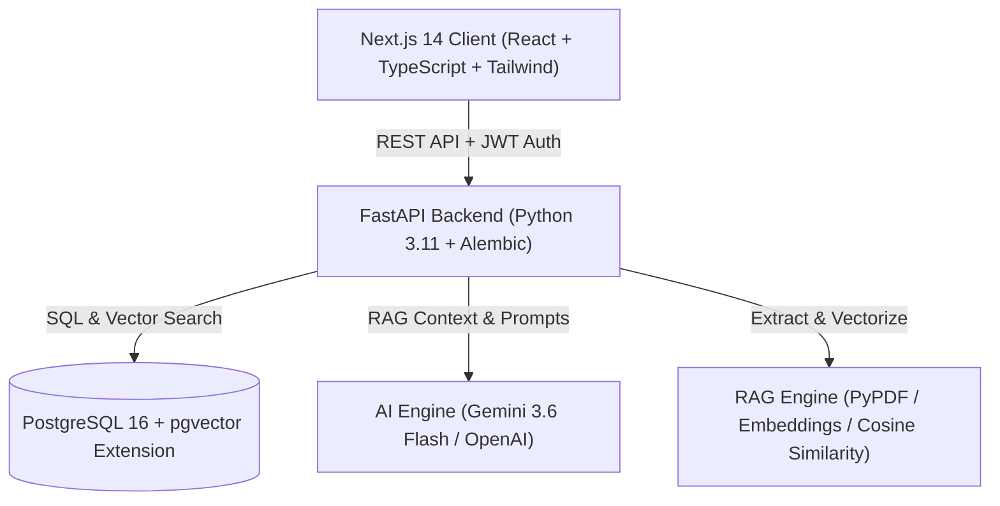

# AI Business Automation Platform 🚀

[](https://www.docker.com/)
[](https://fastapi.tiangolo.com/)
[](https://nextjs.org/)
[](https://github.com/pgvector/pgvector)
[](https://ai.google.dev/)

A full-stack, enterprise-grade **AI Business Automation Platform** combining **Retrieval-Augmented Generation (RAG)**, **Vector Similarity Search**, **AI Task Automation**, **Role-Based Access Control (RBAC)**, and **Docker Orchestration**.

---

## 🏗️ System Architecture



---

## ✨ Core Features

### 1. 🤖 AI RAG & Document Search
- **Asynchronous Document Processing**: Upload PDF/DOCX files. Background workers extract text, generate 768-dim embeddings (`text-embedding-004`), and index into `pgvector`.
- **Cosine Vector Search**: Fast similarity search using PostgreSQL `pgvector`.
- **Source Citations & RAG Confidence Scoring**: Every answer includes document citations, chunk snippets, vector match scores (e.g. `Vector Match: 92%`), and confidence meters.

### 2. ⚡ AI Business Assistant & Task Automation
- **Urgency & Priority Classification**: Analyzes business requests and automatically generates task titles, descriptions, and priority ratings (`HIGH 🔴`, `MEDIUM 🟡`, `LOW 🟢`).
- **Interactive Action Board**: Full task management workflow (`Pending`, `In Progress`, `Completed`).

### 3. 🔐 Security & Role-Based Access Control (RBAC)
- **JWT Authentication**: Secure registration, login, and bearer token verification.
- **RBAC Roles**: Granular role-based permissions (`admin`, `manager`, `employee`).
- **Secret Isolation**: Local `.env` files are strictly git-ignored; zero secret leakage.

### 4. 📊 Enterprise Analytics Dashboard
- Live metric counters for indexed documents, `pgvector` HNSW vector dimensions (768-dim), AI request latency, and task velocity.

---

## 🛠️ Tech Stack

| Component | Technologies |
| :--- | :--- |
| **Frontend** | Next.js 14 (App Router), TypeScript, React, Tailwind CSS, Lucide Icons |
| **Backend** | Python 3.11, FastAPI, Pydantic v2, Uvicorn, Structlog, Pytest |
| **Database & Vectors** | PostgreSQL 16, `pgvector` extension, SQLAlchemy 2.0, Alembic Migrations |
| **AI & RAG** | Google Gemini 3.6 Flash / OpenAI, PyPDF text chunking, Cosine Similarity |
| **DevOps & Containers** | Docker, Docker Compose (with healthchecks & volume hot-reloading) |

---

## ⚡ Quickstart (Running with Docker)

### Prerequisites
- Docker Desktop installed and running on Windows, Mac, or Linux.

### 1. Clone the repository
```bash
git clone https://github.com/shanmuganathan457/ai-business-automation.git
cd ai-business-automation
```

### 2. Configure Environment Variables
Copy the template `.env.example` to `.env`:
```bash
cp .env.example .env
```
Add your **Google Gemini API Key** inside `.env`:
```env
AI_PROVIDER=gemini
GEMINI_API_KEY=your_actual_gemini_api_key_here
GEMINI_MODEL=gemini-3.6-flash
```

### 3. Launch the Stack
```bash
docker compose up -d --build
```

### 4. Access the Applications
- **Frontend App**: [http://localhost:3000](http://localhost:3000)
- **FastAPI Interactive Docs**: [http://localhost:8000/docs](http://localhost:8000/docs)
- **Health Endpoint**: [http://localhost:8000/api/v1/health](http://localhost:8000/api/v1/health)

---

## 🧪 Running Automated Tests

Run the Pytest suite inside the backend container:
```bash
docker exec -it ai_business_backend pytest
```

---

## 📁 Repository Structure

```text
ai-business-automation/
├── backend/
│   ├── app/
│   │   ├── api/          # FastAPI routers (auth, documents, chat, assistant, health)
│   │   ├── core/         # Config, security (JWT/bcrypt), structured logging
│   │   ├── db/           # Session management & SQLAlchemy Base
│   │   ├── models/       # Database models (User, Document, DocumentChunk, Task)
│   │   ├── schemas/      # Pydantic validation schemas
│   │   ├── services/     # AI service wrapper & embedding generator
│   │   └── main.py       # FastAPI application entrypoint
│   ├── alembic/          # Database migrations
│   ├── tests/            # Automated Pytest suite
│   ├── Dockerfile
│   └── requirements.txt
├── frontend/
│   ├── src/
│   │   ├── app/          # Next.js 14 App Router pages (/, /login, /register, /documents, /tasks)
│   │   └── components/   # UI components (Navbar, Glassmorphism widgets)
│   ├── Dockerfile
│   └── package.json
├── docker-compose.yml     # Multi-container orchestration
├── .env.example           # Safe environment template
└── .gitignore             # Strict security rules
```

---

## 👤 Author & License

Developed by **Shanmuganathan** — Open Source under MIT License.
